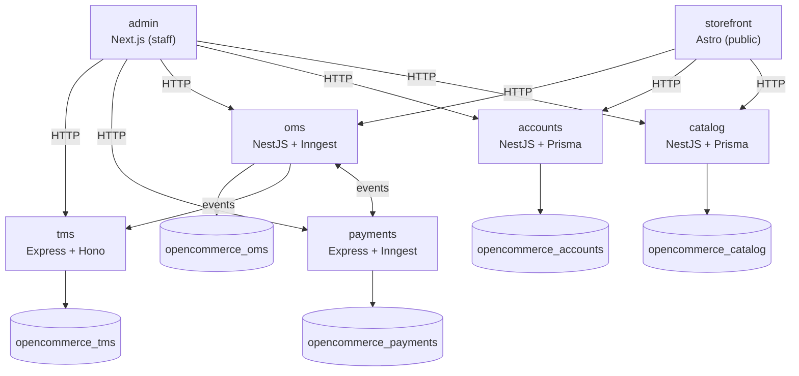

# Open Commerce

**A public, from-scratch e-commerce reference project** — a small but real multi-service commerce platform, built in the open to show how a modern TypeScript stack fits together: several independently deployable backend services, two purpose-built frontends, and a documented Claude Code workflow for building it all consistently.

> 🚧 Early stage. One service (`catalog`) is scaffolded and working; the rest of the map below is the destination, not the current state. See [status](#status) for what's actually built today.

## Why this exists

Most e-commerce reference apps are either toy CRUD demos or too tangled up in a specific SaaS to learn from. Open Commerce aims for the middle: a project small enough to read in an afternoon, but shaped like a real system — separate services with their own databases, async workflows where they actually matter, and a documented engineering process (not just code) that both humans and AI agents can follow the same way.

## Architecture



Each service owns exactly one Postgres database and is reachable only over HTTP or Inngest events — never a shared database, never a direct import of another service's code.

| Service | Stack | Owns |
|---|---|---|
| [`services/catalog`](services/catalog) | NestJS + Prisma | Products, brands, categories, colors, kinds, offers |
| `services/accounts` | NestJS + Prisma | Customers, auth identities, addresses |
| `services/payments` | Express + Inngest | Payment intents, charges, refunds, provider webhooks |
| `services/oms` | NestJS + Inngest | Orders, order lines, fulfillment, order lifecycle workflows |
| `services/tms` | Express + Hono | Shipping quotes, carriers, tracking |

| App | Stack | Audience |
|---|---|---|
| `apps/storefront` | Astro | Public customers — browsing, SEO, checkout |
| `apps/admin` | Next.js | Internal staff — catalog, orders, payments, shipping |

Services never share a database or import each other's code — they talk over HTTP or Inngest events. Full details, per-service folder layout, and the reasoning behind it: **[docs/ARCHITECTURE.md](docs/ARCHITECTURE.md)**.

## Status

| Piece | State |
|---|---|
| `services/catalog` | ✅ Built — products, brands, categories, colors, kinds, offers, Swagger docs, one migration, a seed script |
| `services/accounts`, `services/payments`, `services/oms`, `services/tms` | ⏳ Not started — databases provisioned in `docker-compose.yaml`, code not yet written |
| `apps/storefront`, `apps/admin` | ⏳ Not started |
| `packages/*` (shared code) | ⏳ Empty — created only once a second consumer actually needs something shared |

## Getting started

**Prerequisites:** Node.js, [pnpm](https://pnpm.io), Docker.

```bash
# 1. install dependencies
pnpm install

# 2. start Postgres (provisions one database per service)
docker compose up -d

# 3. run the catalog service
cd services/catalog
npx prisma migrate dev
pnpm dev
```

Swagger UI for `catalog` comes up wherever `main.ts` mounts it once the service is running. Every command, per service and per app, is catalogued in **[docs/COMMANDS.md](docs/COMMANDS.md)**.

## Documentation

Everything about how this project is built lives in [`docs/`](docs) — start with **[docs/GUIDE.md](docs/GUIDE.md)**, the index and the engineering principles behind everything else here.

| Doc | Covers |
|---|---|
| [GUIDE.md](docs/GUIDE.md) | Start here — principles, doc index, the feature workflow |
| [ARCHITECTURE.md](docs/ARCHITECTURE.md) | System map, per-service layering, import boundaries |
| [DATA_LAYER.md](docs/DATA_LAYER.md) | Schema, DTO, and service-method conventions |
| [API_LAYER.md](docs/API_LAYER.md) | Controller/route conventions per framework |
| [FRONTEND.md](docs/FRONTEND.md) | Astro storefront and Next.js admin conventions |
| [SCHEMA.md](docs/SCHEMA.md) · [CODEBASE.md](docs/CODEBASE.md) | Current database schema and service functions, per service |
| [TESTING_UNIT.md](docs/TESTING_UNIT.md) · [TESTING_E2E.md](docs/TESTING_E2E.md) | Testing conventions |
| [GIT_CONVENTIONS.md](docs/GIT_CONVENTIONS.md) · [COMMANDS.md](docs/COMMANDS.md) · [CHECKLISTS.md](docs/CHECKLISTS.md) | Git workflow, CLI reference, pre-PR gate |

## Building with Claude Code

This repo ships a full [Claude Code](https://claude.com/claude-code) skill pipeline under [`.claude/skills/`](.claude/skills), one persona per stage of building a feature — architecture, implementation, testing, review, security, docs, and shipping:

```
oracle → niobe → merovingian → neo → trinity/link → merovingian → morpheus → smith → tank → niobe
```

Drive a whole feature through it:

```
/oracle <a GitHub issue reference, or a description of the feature>
```

...or invoke a single stage directly (`/neo`, `/trinity`, `/morpheus`, ...) for something small. See **[.claude/skills/README.md](.claude/skills/README.md)** for what each persona does, and [docs/GUIDE.md](docs/GUIDE.md#driving-a-feature) for how humans and skills share the work. Every change — whether written by a human or a skill — passes the same [pre-PR checklist](docs/CHECKLISTS.md) before it ships.

## Contributing

1. Branch off `main` following [GIT_CONVENTIONS.md](docs/GIT_CONVENTIONS.md).
2. Build the change following the relevant doc(s) above.
3. Run the [pre-PR checklist](docs/CHECKLISTS.md) before opening a PR.

## License

ISC, per [`package.json`](package.json).
